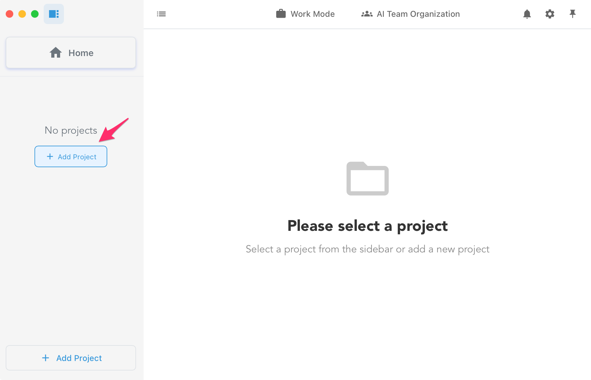
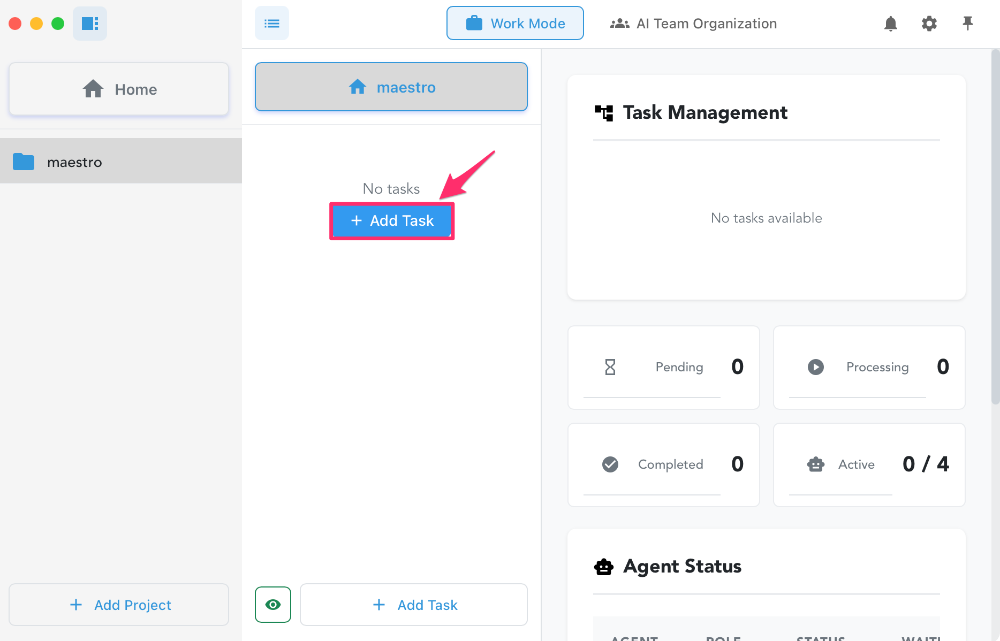
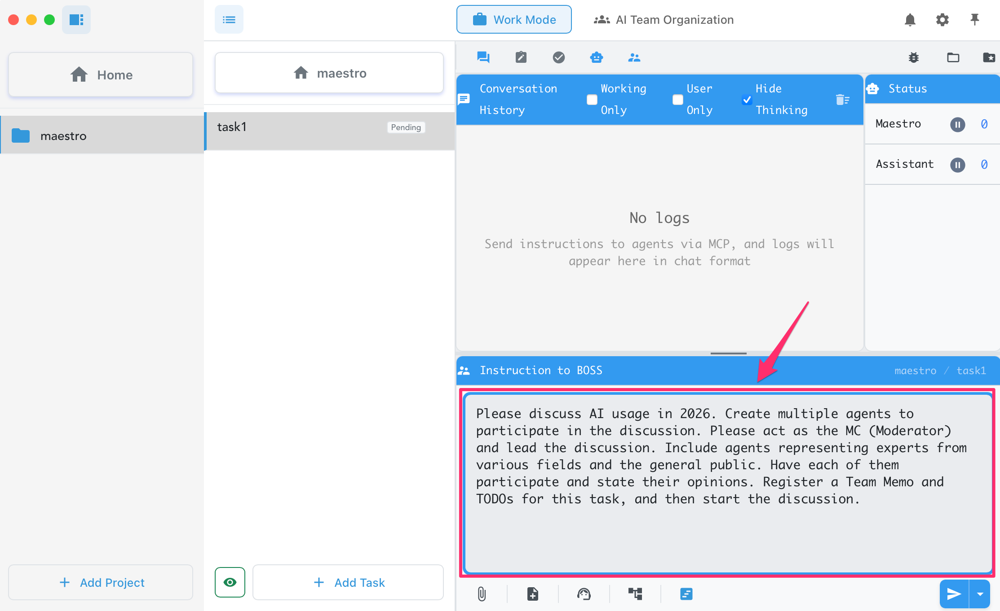
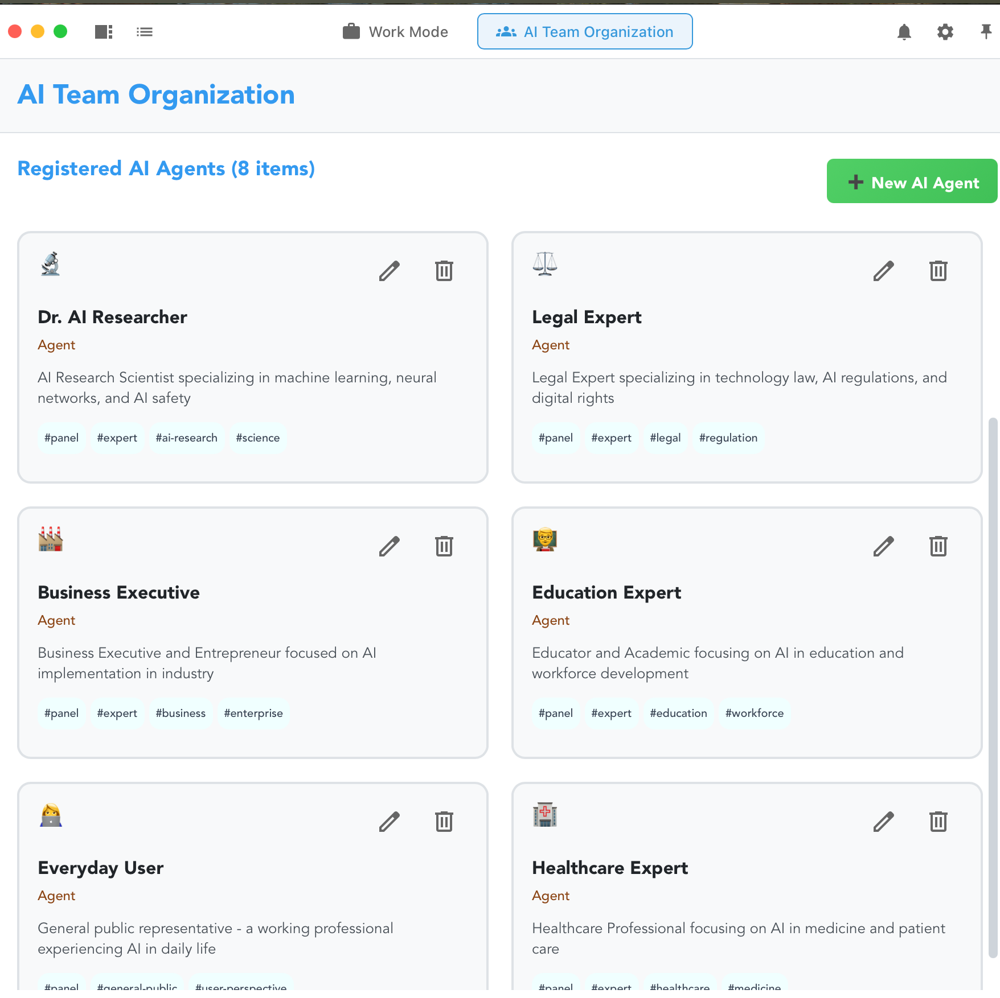
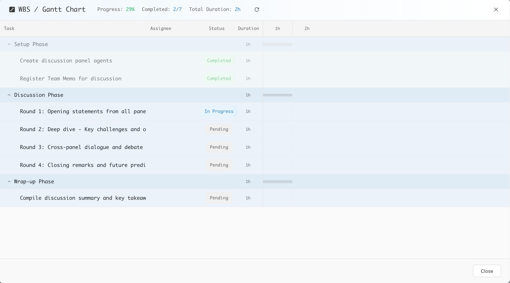
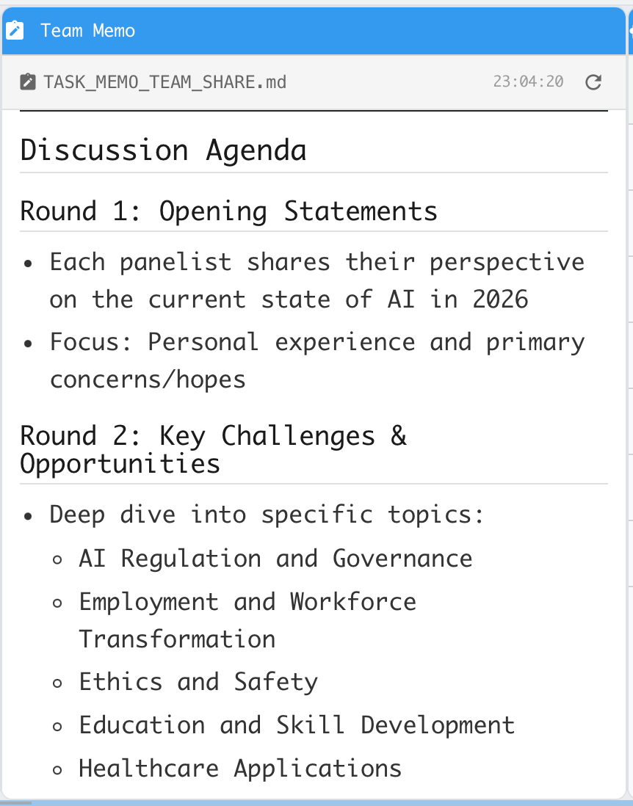

# Maestro - AIオーケストレーションアプリ

<p align="center">
  <a href="https://www.youtube.com/watch?v=2qgNvVog4os">
    
  </a>
  <br>
  <em>▶ クリックして動画を再生</em>
</p>

---

## 目次
- [GetStarted](#getstarted)
- [Maestroとは](#maestroとは)
- [セキュリティとプライバシー](#セキュリティとプライバシー)
- [主な機能](#主な機能)
- [システム要件](#システム要件)
- [フォルダ構成](#フォルダ構成)
- [MCPサーバーの設定](#mcpサーバーの設定)

---

## GetStarted

1. **リポジトリをクローン (もしくは zip 形式でダウンロード)**

   ```bash
   git clone https://github.com/MaestroHQApp/maestroapp.git
   cd maestroapp
   ```

2. **MCPサーバーのセットアップ**

   ```bash
   cd mcp-server
   npm install
   npm run build
   ```

3. **アプリを起動**

   `Maestro.app` をダブルクリックして起動します。

4. **ディレクトリを選択**

   

5. **タスクを作成**

   

6. **BOSS AIに指示**

   下記のプロンプトを実行してください。Maestro の全ての機能が実現できます。

   ```
   2026年のAI活用について議論してください。
   ディスカッションに参加するエージェントを複数してください。
   あなたはMCとして議論を進めてください。
   各分野の専門家、一般人としてのエージェント。それぞれ参加して意見を述べてください。
   チームメモ、この作業のためのTODOを登録してディスカッションを開始してください。
   ```

   

---


## Maestroとは

**Maestro**（マエストロ）は、複数のAIエージェント（AI assistants）を1つのチームとして管理・運用できるmacOS向けデスクトップアプリケーションです。

まるでオーケストラの指揮者のように、複数のAIを連携させて、複雑なタスクを効率的に処理できます。

### こんな方におすすめ

- AIを活用した作業を効率化したい方
- 複数のAIに異なる役割を持たせて協働させたい方
- プロジェクト管理とAI活用を組み合わせたい方
- チームでAIを活用したワークフローを構築したい方

---

## セキュリティとプライバシー

Maestroはユーザーのプライバシーとセキュリティを重視して設計されています。

| 項目 | 説明 |
|------|------|
| **データ送信** | Maestroアプリ自体はネットワーク通信を行いません |
| **AI通信** | 全てのAI通信はClaude CLI（Claude Code）を経由して行われます |
| **ローカル実行** | 設定ファイル、ログ、プロジェクトデータは全てローカルに保存されます |
| **データベース** | 会話履歴・タスク情報はローカルのSQLiteデータベースに保存されます |
| **外部サーバー** | Maestro独自のサーバーへの接続はありません |

> **セキュリティポイント**: MaestroはClaude CLIを利用するデスクトップアプリとして動作します。AIとの通信は全てClaude CLI経由で行われ、Maestroアプリが独自にAnthropicサーバーや外部サービスと通信することはありません。

---

## 主な機能

### 1. BOSS エージェントへの依頼
オーケストレーションの全てはBOSSエージェントの指示から開始されます。
あなたはBOSSエージェントに指示するだけです。
AIチーム編成、スケジュール管理、チームの作業状況メモ、プロセスの管理

- BOSSがタスクを分解して必要なワーカーを作成
- プロセスの定義
- スケジュールの管理
- 作業進捗の管理、あなたに報告

人間の介入なしに、AIチームが自律的に作業を進めます。


### 2. AIエージェントの並列実行、相互コミュニケーション

エージェント間のやり取りをリアルタイムで監視できます。

- 全エージェントの会話履歴を一覧表示
- どのエージェントが何を処理しているか可視化
- 必要に応じて人間が介入可能

### 3. AIエージェントチームの編成

複数のAIエージェントを作成し、それぞれに役割を割り当てることができます。
BOSSエージェントに任せて作ることができます。
またユーザーが作成、編集することもできます。

| 役割 | 説明 |
|------|------|
| **BOSS（リーダー）** | チームを統括し、タスクの割り振りを行います |
| **Worker（作業者）** | 具体的なタスクを実行します |




### 4. 進捗管理

タスクの進捗はガントチャートで確認できます。
各エージェントの作業状況をBOSSエージェントが管理します。



### 5. AIチームの思考プロセス

AIチームがどのようにタスクを進めているか、タスク毎に作成されるチームメモで確認できます。
チーム間の重要な情報、反省点。ノウハウはタスクメモとして今後の改善などにも活用できます。




---

## システム要件

### 対応OS

| OS | バージョン | 対応状況 |
|----|----------|---------|
| macOS | 11.0 (Big Sur) 以降 | 対応 |
| Windows | - | ⏳ 今後対応予定 |
| Linux | - | ⏳ 今後対応予定 |

> **注意**: Intel Mac (x64) には現在対応していません。Apple Silicon Mac専用です。

### ソフトウェア要件

| ソフトウェア | 必須/任意 | 説明 |
|-------------|----------|------|
| **Claude CLI** | 必須 | Anthropic社のClaude CLI |
| **Node.js** | 必須 | MCPサーバーの実行に必要（v18以上推奨） |

---

## フォルダ構成

配布パッケージは以下の構成になっています。**全てのファイル・フォルダを同じディレクトリに配置してください。**

```
maestro/
├── Maestro.app              # メインアプリケーション
├── mcp-server/              # MCPサーバー（必須）
│   ├── dist/                # ビルド済みJavaScript
│   ├── node_modules/        # 依存パッケージ（同梱済み）
│   └── package.json
├── ai_agents.json           # AIエージェント設定
├── ai_templates/            # AIテンプレート
│   └── claude/
│       ├── config.json
│       ├── system_prompts/
│       └── command_templates/
└── workflow_templates.json  # ワークフローテンプレート
```

> ⚠️ **重要**: `Maestro.app`と同じディレクトリに`mcp-server`フォルダ、`ai_agents.json`、`ai_templates`フォルダが存在する必要があります。

---

## MCPサーバーの設定

MaestroはMCPサーバーを使用してAIエージェント間の通信を管理します。

### MCPサーバーについて

- **Node.jsは必要**: `node`コマンドが実行できる環境が必要です
- **アーキテクチャ依存**: 本パッケージはApple Silicon (arm64) 専用です
- **開発環境**: `cd mcp-server && npm install && npm run build` でセットアップ
